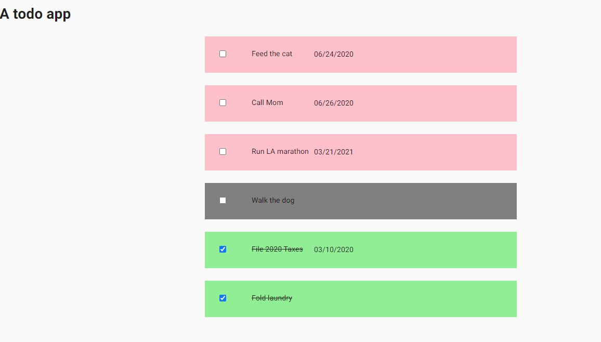
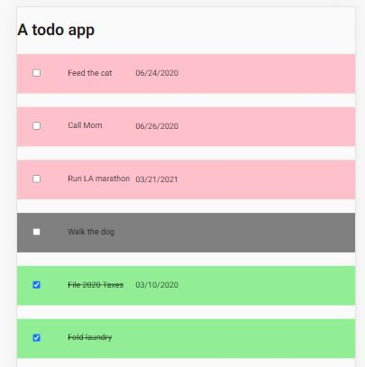
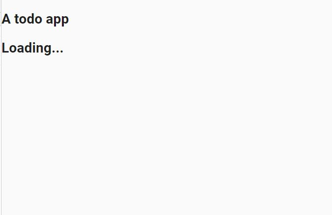

# To run app
The below commands will run the development server of this next.js application. This is all you need for this sample .

First, you will also need to change the value for the API key in `next.config.json`. If in any case this does not work, you can substitue the values in the actual API call. Grep for `process.env.apikey`.

```
npm i
npm run dev
```

You can then visit [http://localhost:3000](http://localhost:3000)

### Desktop


### Mobile


### Loading state
